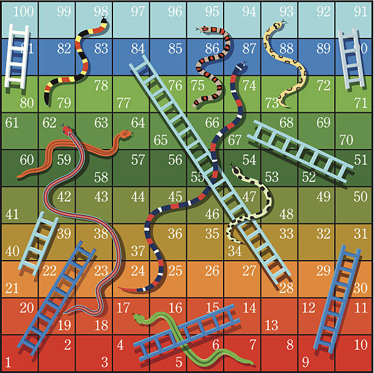

# Snake and Ladder Game

A simple implementation of the classic Snake and Ladder board game.

## Features

- Playable by 2 or more players
- Snakes and ladders placed randomly or as per classic rules
- Simple CLI interface

## Board


## How to Run

1. Clone the repository.
2. Run the main Python file:
   ```
   python main.py
   ```

## Requirements

- Python 3.x

## License

MIT License